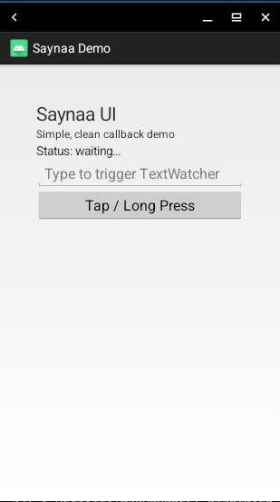

# Saynaa Android

Saynaa Android is an Android application runtime for the Saynaa programming language. It combines the Saynaa VM with a JNI-based Android bridge so Saynaa scripts can create views, call Java APIs, register listener proxies, and build Android UI directly on-device.

## Screenshot of the demo app running on an Android device:


## Highlights

- Run Saynaa scripts inside an Android app.
- Access Android and Java APIs through the `java` module.
- Build native Android UI from Saynaa code.
- Register Java interface callbacks with `java.createProxy(...)`.
- Use bundled scripts such as [app/src/main/assets/main.sa](app/src/main/assets/main.sa)
- Ship native bridge code through JNI and NDK build integration.

## Project layout

- [app](app) — Android application module.
- [app/src/main/assets](app/src/main/assets) — bundled Saynaa scripts and examples.
- [app/src/main/jni/saynaajava](app/src/main/jni/saynaajava) — JNI bridge between Saynaa and Android/Java.

## Requirements

- Android SDK with API 34.
- Android NDK `26.1.10909125`.
- Java 8-compatible toolchain.
- Gradle available locally, or the project wrapper after initial download succeeds.

Current Android config from [app/build.gradle](app/build.gradle):

- `applicationId`: `com.android.saynaa`
- `minSdkVersion`: `21`
- `targetSdkVersion`: `34`
- `compileSdkVersion`: `34`
- supported ABIs: `armeabi-v7a`, `arm64-v8a`

## Build

Build the debug APK:

- `gradle :app:assembleDebug`

Or use the wrapper:

- `./gradlew :app:assembleDebug`

The debug APK is generated under [app/build/outputs/apk](app/build/outputs/apk).

## Install and run

Install the debug build on a connected device:

- `adb install -r app/build/outputs/apk/debug/app-debug.apk`

Launch the app:

- `adb shell am start -n com.android.saynaa/.activity.MainActivity`

View logs:

- `adb logcat | grep saynaajava`

One Command:
- `gradle :app:assembleDebug && adb uninstall com.android.saynaa ; adb install -r app/build/outputs/apk/debug/app-debug.apk && adb logcat -c && adb shell am start -n com.android.saynaa/.activity.MainActivity && sleep 4 && adb logcat -d | grep -E "saynaajava|SaynaaMain|AndroidRuntime|Saynaa|MainActivity"`

## How scripting works

The app executes Saynaa source and exposes Android integration through built-in functions plus the `java` module.

Typical script flow:

- get the current activity with `getActivity()`
- import the `java` module
- bind Java classes with `java.bindClass(...)`
- create Android objects
- register interface callbacks with `java.createProxy(...)`

See the main example in [app/src/main/assets/main.sa](app/src/main/assets/main.sa).

## `java` bridge quick example

```sa
import java

activity = getActivity()
TextView = java.bindClass("android.widget.TextView")

view = TextView(activity)
view.setText("Hello from Saynaa")
activity.setContentView(view)
```

Callback example:

```sa
import java

activity = getActivity()
Button = java.bindClass("android.widget.Button")
LinearLayout = java.bindClass("android.widget.LinearLayout")

click_cb = {
	onClick: function(v)
		v.setText("Button clicked")
		print("clicked")
	end
}

button = Button(activity)
button.setText("Click me")
button.setOnClickListener(java.createProxy('android.view.View$OnClickListener', click_cb))

layout = LinearLayout(activity)
layout.setOrientation(LinearLayout.VERTICAL)
layout.addView(button)

activity.setContentView(layout)
```

## Important runtime files

- [app/src/main/assets/main.sa](app/src/main/assets/main.sa) — main Saynaa demo.
- [app/src/main/assets/hello.sa](app/src/main/assets/hello.sa) — simple imported module example.
- [app/src/main/jni/saynaajava/saynaajava.c](app/src/main/jni/saynaajava/saynaajava.c) — native bridge implementation.
- [app/src/main/java/com/android/saynaa/saynaajava/JavaBridge.java](app/src/main/java/com/android/saynaa/saynaajava/JavaBridge.java) — Java reflection and proxy bridge.

## Architecture summary

- Java side hosts the Android app and reflection utilities.
- JNI bridge converts values between Saynaa and Java.
- Saynaa scripts use built-ins and the `java` module to drive Android behavior.
- wrapper classes such as `JavaClass`, `JavaObject`, and `JavaMethod` are created internally by the bridge.

## Notes

- The public scripting surface is the `java` module.
- The JNI source file and Java package still use `saynaajava` naming internally because they are part of the Android implementation layer.
- The project includes reference folders used during development; the active runtime for users is Saynaa.

## Status

The repository currently builds successfully with:

- `gradle :app:assembleDebug`

If you want to extend the runtime, the safest starting points are the assets in [app/src/main/assets](app/src/main/assets) and the bridge code in [app/src/main/jni/saynaajava](app/src/main/jni/saynaajava).